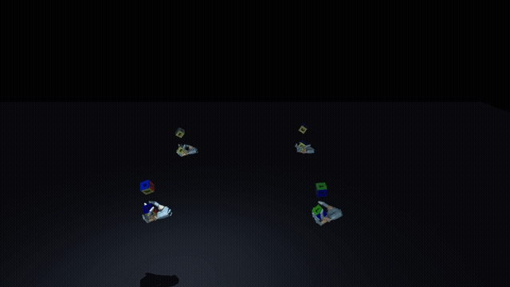

# Wuji UniLab

[中文](README_zh.md)

In-hand cube reorientation with the Wuji Hand five-finger dexterous hand: the policy drives 20 finger joints to continuously turn a palm-held cube toward random goal orientations. This project migrates the task from [wuji-mjlab](https://github.com/wuji-technology/wuji-mjlab) onto [UniLab](https://github.com/Motphys/UniLab) + [UniSim](https://github.com/unilabsim/unisim)'s MuJoCo-Warp (`mjwarp`) GPU physics backend + [unilab-rl](https://github.com/unilabsim/unilab_rl) (rsl-rl PPO). Robot meshes and textures ship with the repository.



*Simulation playback of this implementation (`wuji-play` record mode, mjwarp, 4 parallel environments); wireframe cubes are goal-pose ghosts.*

## Capabilities

| Capability | Status |
| --- | --- |
| Task `WujiHand_Reorient` | Full-scale training (8192 envs × 5000 iterations) completed; the policy reorients continuously |
| Task `WujiHand_Reorient_Light` | Lighter configuration variant (4096 envs × 7500 iterations) |
| Physics backend | `mjwarp` only; requires NVIDIA GPU + CUDA; no silent backend fallback |
| Statistical evaluation | `wuji-eval`: per-trial success rate / drop rate / minimum orientation error, same protocol as the source project |
| Playback / recording | `wuji-play`: off-screen mp4 or interactive viewer |
| Policy export | `wuji-export`: ONNX + I/O schema with enforced numerical-agreement check |
| Real-robot deployment | Not validated; this repository contains no deployment code |

Numbers reported by the upstream release (e.g. 85% sim2real) belong to the original wuji-mjlab implementation and have not been reproduced here under the same protocol.

## First run

Requires Linux x86_64, Python 3.11–3.13, an NVIDIA GPU with CUDA drivers, and [uv](https://docs.astral.sh/uv/). The first run compiles Warp kernels.

```bash
git clone https://github.com/unilabsim/wuji_unilab.git && cd wuji_unilab
uv sync --locked --all-groups
uv run --no-sync wuji-assets       # verify the bundled assets
uv run --no-sync wuji-list-envs    # list tasks
```

All dependencies resolve from PyPI via the lockfile (UniLab 1.2.0, UniSim 1.2.0, unilab-rl 1.2.0) — no separate UniLab clone is needed. This repository itself is source-install only and is not published to PyPI. The repository does not ship a trained checkpoint; the training section below produces your own.

## Training and evaluation

```bash
# Default training (8192 envs × 5000 iterations, ~6 hours on an RTX 4090)
uv run --no-sync wuji-train --task WujiHand_Reorient

# Small smoke check (a few minutes; does not imply the behavior is learned)
uv run --no-sync wuji-train --task WujiHand_Reorient algo.num_envs=32 algo.max_iterations=3 algo.num_steps_per_env=8
```

Outputs land in `logs/<task>/<date>_<time>_mjwarp/` (checkpoints, TensorBoard events, run configuration). Append Hydra overrides such as `algo.num_envs=1024`; task and backend routing keys are locked by the CLI and cannot be overridden.

```bash
# Statistical evaluation (default 100 trials, protocol aligned with the source evaluator, JSON output)
uv run --no-sync wuji-eval --task WujiHand_Reorient --checkpoint-file logs/.../model_4999.pt --output eval_results.json

# Playback: off-screen mp4 recording (EGL)
MUJOCO_GL=egl uv run --no-sync wuji-play --task WujiHand_Reorient --checkpoint-file logs/.../model_4999.pt \
  training.play_render_mode=record training.play_steps=1200

# Playback: interactive viewer (needs a desktop display; unset MUJOCO_GL if you set it)
env -u MUJOCO_GL uv run --no-sync wuji-play --task WujiHand_Reorient --checkpoint-file logs/.../model_4999.pt \
  training.play_render_mode=interactive

# Export an ONNX policy
uv run --no-sync wuji-export --checkpoint-file logs/.../model_4999.pt
```

On multi-GPU machines select a card with `CUDA_VISIBLE_DEVICES`. Evaluation here uses PyTorch checkpoints + mjwarp and is not directly comparable to the upstream CPU MuJoCo + ONNX numbers; checkpoints are not interchangeable between the two projects.

## How to modify

| What you want to change | Entry file |
| --- | --- |
| Rewards / terminations / curriculum / metrics | `src/wuji_unilab/tasks/reorient/rewards.py` |
| Observations (history, noise) | `src/wuji_unilab/tasks/reorient/observations.py` |
| Goal command (success threshold, hold steps) | `src/wuji_unilab/tasks/reorient/commands.py` |
| Actions and joint control | `src/wuji_unilab/tasks/reorient/actions.py` |
| Reset, domain randomization, disturbances | `src/wuji_unilab/tasks/reorient/events.py` |
| Hyperparameters, networks, obs/action configuration | `src/wuji_unilab/conf/ppo/task/wuji_reorient/mjwarp.yaml` |
| Robot / cube models | `src/wuji_unilab/assets/` (update the `assets/manifest.json` checksums afterwards) |

Development checks: `make check`, `make test`, `make test-all` (the last requires CUDA).

## Credits

The task, robot assets, and reward semantics come from [wuji-mjlab](https://github.com/wuji-technology/wuji-mjlab) (Wuji Technology); please cite the upstream project when referencing this work. Infrastructure is provided by [UniLab](https://github.com/Motphys/UniLab), [UniSim](https://github.com/unilabsim/unisim), [unilab-rl](https://github.com/unilabsim/unilab_rl) (built on [rsl_rl](https://github.com/leggedrobotics/rsl_rl)), and [mujoco-warp](https://github.com/google-deepmind/mujoco_warp).

This project is licensed under [Apache-2.0](LICENSE).
